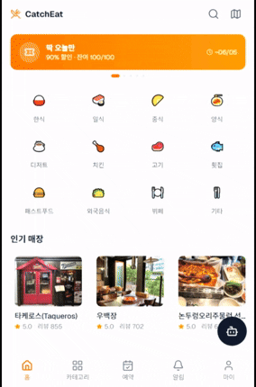
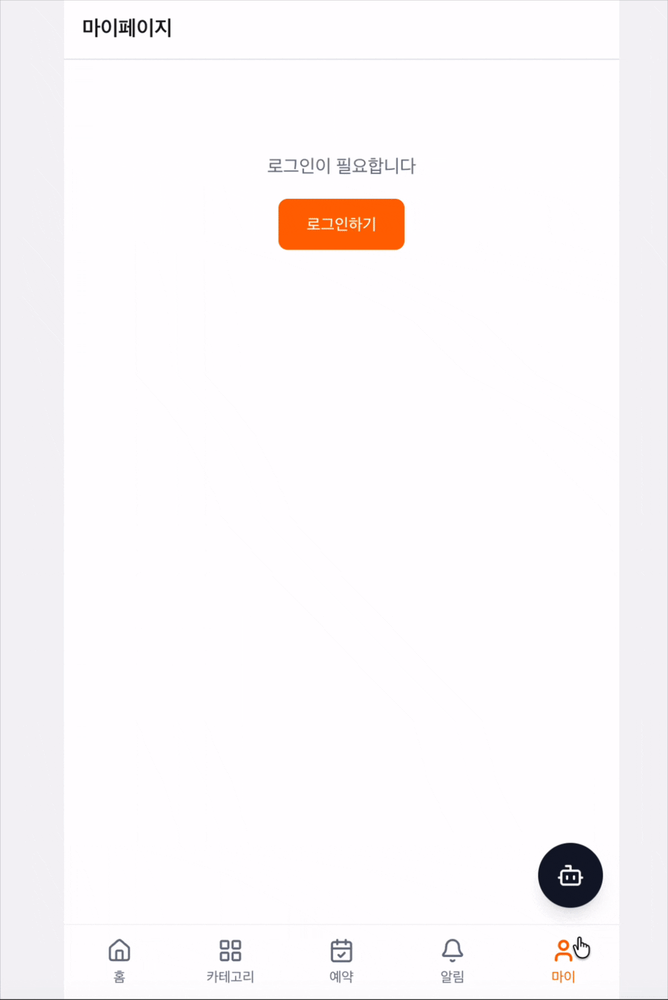
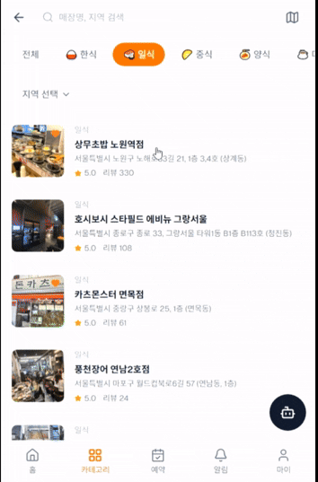
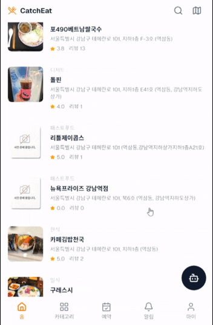
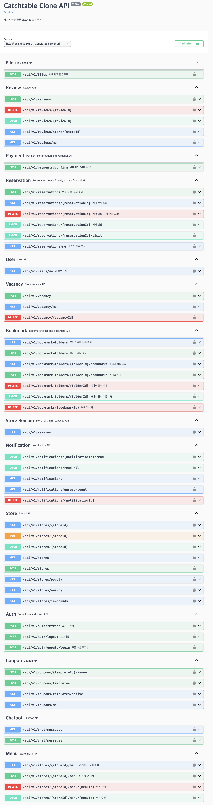
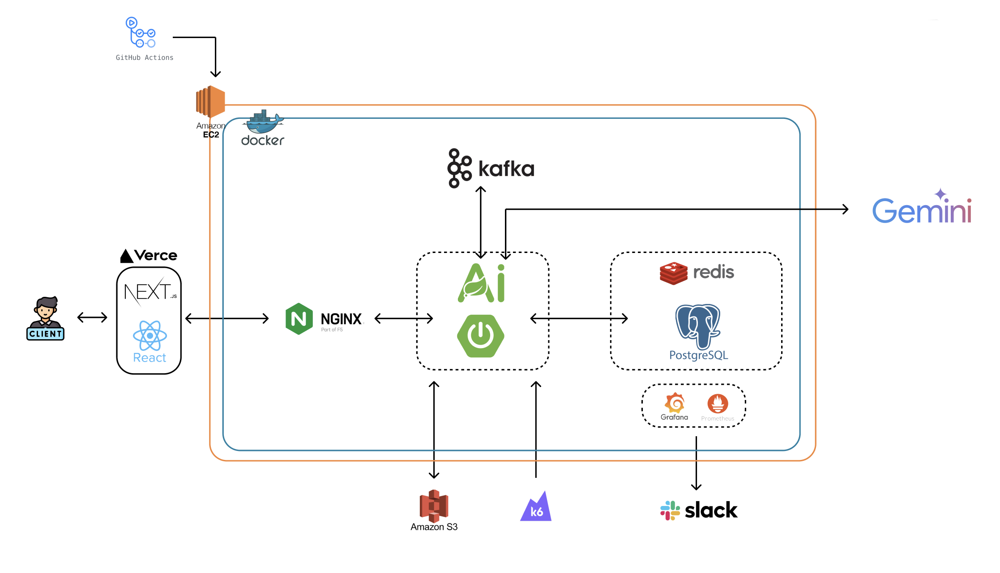
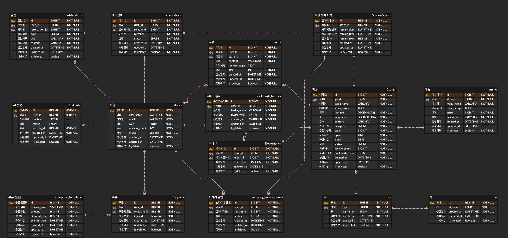
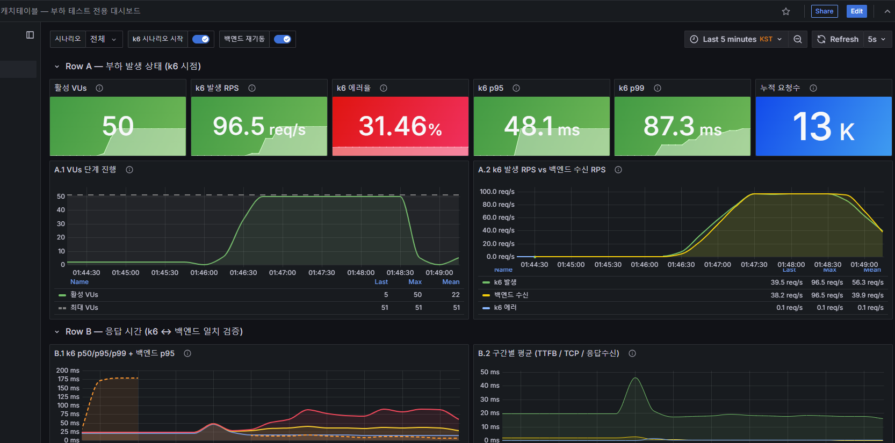
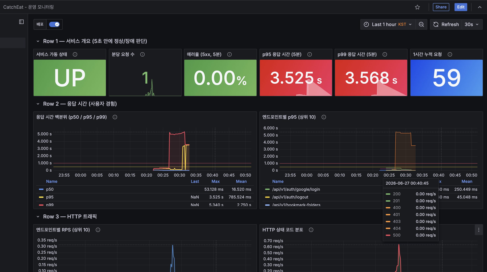

<h1 align="center"> CatchEAT </h1>
<div align="center"> 
<h3><b> 맛집 예약 / 빈자리 알림 / AI 챗봇 </b></h3><br>



<h3><b> Catchtable Clone Coding Project </b></h3>
<br>
</div>
<br><br>


# 📖 Table of Contents
* [Introduction](#-introduction)
* [Demo](#-demo)
* [API](#-api)
* [System Architecture](#-system-architecture)
* [ERD](#-erd)
* [Tech Stack](#-tech-stack)
* [Monitoring](#-monitoring)
* [Directory Structure](#-directory-structure)
* [How to Start](#-how-to-start)
* [Team Members](#-team-members)

<br>

# 📣 Introduction

### 소개
본 프로젝트는 레스토랑 예약 플랫폼 캐치테이블을 클론 코딩하며 매장 검색, 예약, 선착순 쿠폰,
실시간 빈자리 알림, AI 챗봇 서비스를 구현하고 가상 트래픽이 몰리는 상황에서 아키텍처적 결함을 확인하고 개선한 백엔드 엔지니어링 프로젝트입니다.

### 문서
> 📦 Backend Repo: [catchtable-clone/backend](images/catchtable-clone/backend)
>
> 📦 Frontend Repo: [catchtable-clone/frontend](images/catchtable-clone/frontend)

<br>

- **맛집을 검색하고 실시간 잔여 좌석을 예약하는 레스토랑 예약 플랫폼**
- **원하는 매장의 빈자리가 생기면 실시간으로 알림 (Vacancy 구독 + Kafka)**
- **선착순 쿠폰 발급 — Redis Lua + 분산 락으로 대량 트래픽에도 정확한 재고 관리**
- **PortOne(카카오페이) 연동 예약금 결제**
- **위치 기반 매장 검색 (PostGIS) — 내 주변 맛집 탐색**
- **AI 챗봇(Google Gemini)으로 간편하게, 매장 추천/예약 도우미**
- **북마크로 나만의 맛집 리스트 관리**

<br>

# 🕺🏻 Demo

### 메인 / 매장 탐색
> 카테고리 / 지역 / 위치 기반으로 맛집들을 둘러보는 화면입니다.
<br>

<br><br>

### 로그인 / 마이페이지
> Google 간편 로그인과 사용자의 예약 내역 /리뷰 /쿠폰 관리, 관리자(매장/메뉴/쿠폰) 화면입니다.
<br>

<br><br>

### 매장 상세 / 예약 / 결제
> 매장 정보 / 메뉴를 확인하고 원하는 시간의 잔여 좌석을 예약합니다. 결제 화면은 PortOne 연동 카카오페이 서비스입니다.
<br>

<br><br>

### 빈자리 알림
> 마감된 시간대의 빈자리를 구독하고, 자리가 나면 알림을 받습니다.
<br>

<br><br>

### 쿠폰
> 선착순 쿠폰을 발급받는 화면입니다.
<br>

<br><br>

### AI 챗봇
> Google Gemini 기반 챗봇과 대화하며 예약을 진행합니다.
<br>

<br><br>

<br>

# 📗 API
<div align="center">

</div>
<br><br>

# 🛠️ System Architecture <a name="-system-architecture"></a>
<div align="center">
  
</div>
<br><br>

# 🔑 ERD
<div align="center">
  
</div>
<br><br>


# 💻 Tech Stack

<div align="center">
  <table>
    <tr>
      <th>Field</th>
      <th>Technology of Use</th>
    </tr>
    <tr>
      <td><b>Frontend</b></td>
      <td>
        
        
        
        
        
        
        
        
        
        
      </td>
    </tr>
    <tr>
      <td><b>Backend</b></td>
      <td>
        
        
        
        
        
        
        
        
        
        
        
      </td>
    </tr>
    <tr>
      <td><b>Messaging / Cache</b></td>
      <td>
        
        
        
      </td>
    </tr>
    <tr>
      <td><b>Database</b></td>
      <td>
        
        
      </td>
    </tr>
    <tr>
      <td><b>AI</b></td>
      <td>
        
        
      </td>
    </tr>
    <tr>
      <td><b>External API</b></td>
      <td>
        
        
        
      </td>
    </tr>
    <tr>
      <td><b>DevOps</b></td>
      <td>
        
        
        
        
        
      </td>
    </tr>
    <tr>
      <td><b>Monitoring</b></td>
      <td>
        
        
        
        
        
      </td>
    </tr>
    <tr>
      <td><b>Load Test</b></td>
      <td>
        
      </td>
    </tr>
    <tr>
      <td><b>ETC</b></td>
      <td>
        
        
      </td>
    </tr>
  </table>
</div>
<br><br>

# 📊 Monitoring
<div align="center">
    
    
</div>

# 📂 Directory Structure

<details>
<summary>CatchEAT</summary>
<pre>
<code>
🗂️ catchtable-clone
┣ 📂 backend                         # Spring Boot 4 (Java 21) REST API
┃ ┣ 📂 src/main/java/com/catchtable
┃ ┃ ┣ 📂 bookmark                    # 북마크 / 즐겨찾기 폴더
┃ ┃ ┣ 📂 chatbot                     # AI 챗봇 (Spring AI + Gemini)
┃ ┃ ┣ 📂 coupon                      # 선착순 쿠폰 (Redis Lua + 분산 락)
┃ ┃ ┣ 📂 file                        # 파일 업로드
┃ ┃ ┣ 📂 menu                        # 메뉴
┃ ┃ ┣ 📂 notification                # 알림 (Kafka)
┃ ┃ ┣ 📂 payment                     # 결제 (PortOne)
┃ ┃ ┣ 📂 remain                      # 잔여 좌석 슬롯
┃ ┃ ┣ 📂 reservation                 # 예약
┃ ┃ ┣ 📂 review                      # 리뷰 / 평점
┃ ┃ ┣ 📂 store                       # 매장 (PostGIS 위치 검색)
┃ ┃ ┣ 📂 user                        # 회원 / 인증
┃ ┃ ┣ 📂 vacancy                     # 빈자리 알림 구독
┃ ┃ ┗ 📂 global                      # config, security, lock, common, exception
┃ ┣ 📂 data                          # 시드 SQL & CSV
┃ ┣ 📂 k6                            # 부하 테스트 시나리오
┃ ┣ 📂 grafana / monitoring / nginx  # 인프라 설정
┃ ┣ 📃 docker-compose.dev.yml
┃ ┣ 📃 docker-compose.prod.yml
┃ ┣ 📃 Dockerfile
┃ ┗ 📃 build.gradle
┗ 📂 frontend                        # Next.js 16 (React 19, TypeScript)
  ┗ 📂 src
    ┣ 📂 app                         # App Router 페이지
    ┣ 📂 components                  # 공통 / 매장 컴포넌트
    ┣ 📂 hooks
    ┣ 📂 lib/api                     # API 클라이언트
    ┣ 📂 stores                      # Zustand 스토어
    ┗ 📂 types
</code>
</pre>
</details>
<br>

# 🧐 How to Start

### Prerequisites
- Java 21
- Docker / Docker Compose
- Node.js 20+

### 1. Clone
```bash
git clone images/catchtable-clone/backend.git
git clone images/catchtable-clone/frontend.git
```

### 2. env setting

* `backend/.env`
```
DB_NAME=
DB_USER=
DB_PASSWORD=
DB_PORT=

GOOGLE_CLIENT_ID=
GOOGLE_CLIENT_SECRET=
GOOGLE_PLACES_API_KEY=

JWT_SECRET=
FRONTEND_URL=

GEMINI_API_KEY=
PORTONE_SECRET_KEY=

GRAFANA_USER=
GRAFANA_PASSWORD=
```

* `frontend/.env`
```
NEXT_PUBLIC_API_URL=
NEXT_PUBLIC_GOOGLE_CLIENT_ID=
NEXT_PUBLIC_KAKAO_MAP_KEY=
NEXT_PUBLIC_PORTONE_STORE_ID=
NEXT_PUBLIC_PORTONE_CHANNEL_KEY=
NEXT_PUBLIC_USE_MOCK=
```

### 3. Run Infra & Backend
```bash
cd backend
docker compose -f docker-compose.dev.yml up -d   # PostgreSQL · Redis · Kafka
./gradlew bootRun                                # http://localhost:8080
```

### 4. Frontend Start
```bash
cd frontend
npm install
npm run dev                                       # http://localhost:3000
```

### 5. 로컬 환경에서 접속
- Web: `http://localhost:3000`
- Swagger: `http://localhost:8080/swagger-ui.html`

<br>

# 👨‍👩‍👧‍👦 Team Members

<table width="800">
<tbody>
<tr>
<th>Name</th>
<td width="150" align="center">김재범</td>
<td width="150" align="center">김동안</td>
<td width="150" align="center">이상진</td>
<td width="150" align="center">이주희</td>
</tr>
<tr>
<th>Profile</th>
<td width="150" align="center">
<a href="https://github.com/jaebeom79">

</a>
</td>
<td width="150" align="center">
<a href="https://github.com/docodocod">

</a>
</td>
<td width="150" align="center">
<a href="https://github.com/silkair">

</a>
</td>
<td width="150" align="center">
<a href="https://github.com/johe00123">

</a>
</td>
</tr>
<tr>
<th>Role</th>
<td width="150" align="center">Backend</td>
<td width="150" align="center">Backend</td>
<td width="150" align="center">Backend</td>
<td width="150" align="center">Backend</td>
</tr>
<tr>
<th>GitHub</th>
<td width="150" align="center">
<a href="https://github.com/jaebeom79"></a>
</td>
<td width="150" align="center">
<a href="https://github.com/docodocod"></a>
</td>
<td width="150" align="center">
<a href="https://github.com/silkair"></a>
</td>
<td width="150" align="center">
<a href="https://github.com/johe00123"></a>
</td>
</tr>
</tbody>
</table>
<br><br>